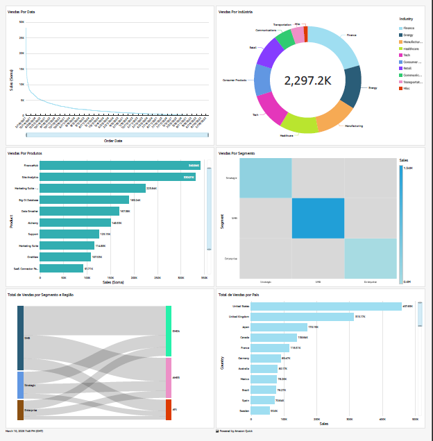

# SaaS Sales Analytics with Amazon QuickSight

Projeto de análise de vendas SaaS utilizando Amazon QuickSight para explorar tendências de mercado, sazonalidade e detecção de anomalias no faturamento.

## Objetivo

Transformar dados brutos de vendas em insights estratégicos por meio de visualização de dados e análise estatística.

## Ferramentas Utilizadas

- Amazon QuickSight
- SPICE In-memory Engine
- QuickSight Q (Generative BI)
- Estatística Descritiva (Z-score)

## Principais Análises

- Evolução temporal das vendas
- Distribuição de receita por indústria
- Fluxo de vendas entre segmentos e regiões (Sankey Diagram)
- Distribuição geográfica de vendas
- Detecção de anomalias no faturamento mensal

## Principais Insights

- Crescimento de vendas de +51,6% entre 2021 e 2024
- Forte sazonalidade com pico no quarto trimestre
- Setor financeiro como principal segmento de receita
- Identificação de anomalia em novembro de 2024 (Z-score +2,57)

## Dashboard

## Documentação Completa

A análise detalhada do projeto pode ser encontrada em:

`docs/analise-vendas-saas.md`

## Autor

Karla Renata